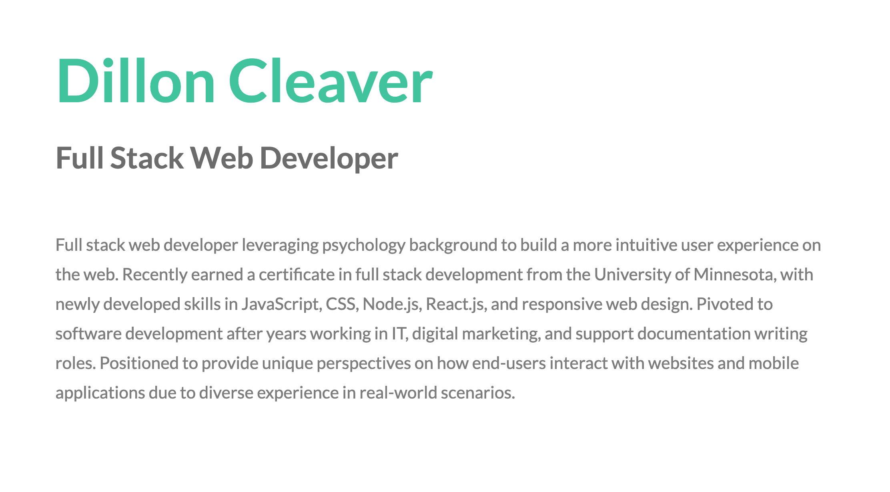

<h1 align="center">Dillon Cleaver's Portfolio</h1>

## Table of Contents

- [About](#about)
- [Built With](#built_using)
- [Questions](#questions)
- [Screenshots](#screenshots)

## 

This is my official web development portfolio. This is where you'll find the latest projects I've been working on as well as my most up-to-date contact information.

## 

- HTML
- CSS
- JavaSript
- jQuery

This website uses a template designed by @ajlkn on http://html5up.net. I'm using it for free under their CCA 3.0 license (html5up.net/license).

## 

- If you wish to reach me, feel free to send me an email at cleadi@fastmail.com
- I can also be reached via LinkedIn: https://www.linkedin.com/in/dillon-cleaver/
- GitHub profile: https://github.com/cleadi

## 

